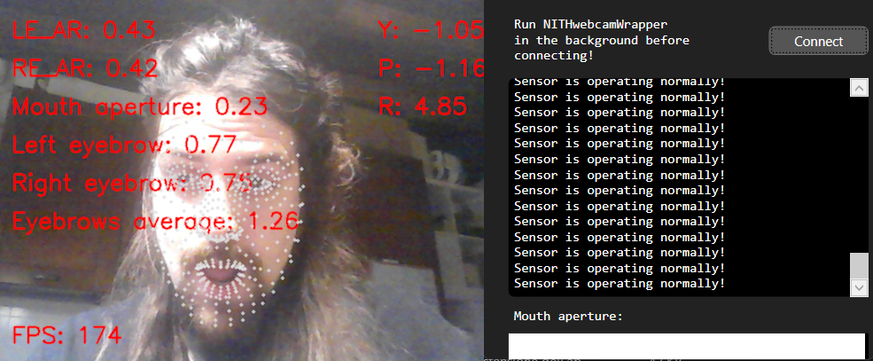

# NITHexample
*An application that provides a simple example of how the NITH framework works.*

  

 

  

 

NITHexample is an extremely simple WPF application designed to demonstrate the functionalities of the NITH framework and [NITHlibrary](https://github.com/LIMUNIMI/NITHlibrary). 

It provides simple mouse emulation through mouth aperture, which controls left mouse button.
Its functionality is trivial and extremely simple, and it's not intended as something "useful" to be used, but instead a simple example for developers to understand how to develop applications within the NITH framework.

## Requirements
Since it is a WPF application, it requires Windows operating system.

## Functionality
- **Mouse Control via Mouth Movements**: The application allows users to perform mouse clicks by opening and closing their mouths. When the mouth is opened beyond a certain threshold, the left mouse button is clicked down. Conversely, closing the mouth releases the mouse button.
- **Automatic calibration**: the application automatically calibrates itself and the mouth aperture thresholds while running, while the user moves its mouth. It's advisable to perform a full mouth opening and closure upon application startup.
  
## Getting Started
To run the application, simply launch `NITHexample.exe` located in the `bin/release` directory.
Please allow for UDP communication, as the application requires it to receive mouth aperture data.

The application won't do anything if not receiving webcam data. In order to do so, you must run also *NITHwebcamWrapper* in the background (and of course have an active webcam on your PC or laptop :)).
Please refer to the instruction provided in the  [NITHwebcamWrapper](https://github.com/LIMUNIMI/NITHwebcamWrapper) GitHub repository in order to install and run it. An active installation of Python 3 is required (it has been tested on 3.14)

## Exploring and modifying the code
The source code for this application can offer an insight into how the NITH library functions, and a starting point to make new ones. Users interested in exploring the code can clone this repository along with its dependencies. Please clone the following repositories and place their containing folders in the same root folder alongside the one containing NITHexample:
- [NITHlibrary](https://github.com/LIMUNIMI/NITHlibrary)
- [NITHdmis](https://github.com/LIMUNIMI/NITHdmis)
- [NITHemulation](https://github.com/LIMUNIMI/NITHemulation)

This program is built on top of [NITHtemplate](https://github.com/LIMUNIMI/NITHtemplate) and is primarily developed in C#.
